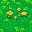
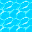
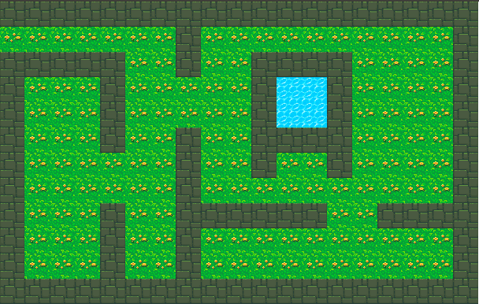
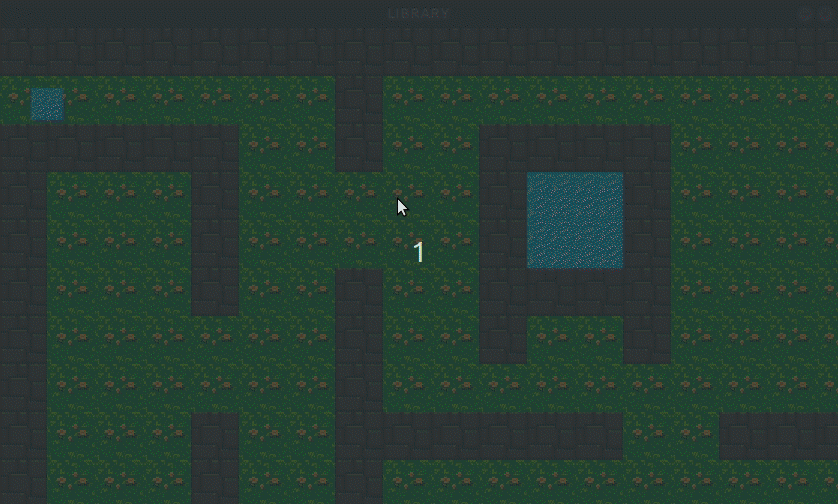

# Sumário
**[SNDE](#snde)** <br/>
**[Usando a lib](#usando-a-lib)**<br/>
**[O que é](#o-que-é)**<br/>

**[01 - Janela](#01-janela)**
* *[Criar janela](#criar-janela)*

**[02 - Imagem](#02-imagem)**
* *[Carregando imagens](#carregando-imagens)*

**[03 - Desenhando imagens](#03-desenhando-imagens)**
* *[draw_image](#draw_image)*
* *[update_screen](#update_screen)*

**[04 - Cenário](#04-cenário)**
* *[Criando mapa](#criando-mapa)*
* *[Mapa montado](#mapa-montado)*
* *[Carregar mapa](#carregar-mapa)*
* *[Desenhar mapa](#desenhar-mapa)*
* *[Colisão](#colisão)*
* *[Camera](#camera)*

**[05 - Eventos](#05-eventos)**
* *[Adicionando eventos](#adicionando-eventos)*
* *[Teclado](#teclado)*
* *[Janela](#janela)*
* *[Outros Eventos](#outros-eventos)*

**[06 - Personagem](#06-personagem)**
* *[Criar personagem](#criar-personagem)*
* *[Animação](#animação)*
* *[Movimentação](#movimentação)*

#

# SNDE
***Sem Necessiade De Existir.***

**Objetivo:**
Apenas criar código descartável. E usar um pouco da ***linguagem C*** / ***Markdown***.

## O que é?
A biblioteca contém funções que abstrai funcionalidades da biblioteca ***Allegro*** facilitando o uso na criação de protótipos de jogos 2D.

***Observação***
Os tipos de dados ***```Window```*** , ***```Image```*** , ***```Events```*** e outros presentes nesse documento, são apenas ***alias*** para a biblioteca ***Allegro*** ou são ***alias*** de componentes da propria biblioteca **snde**.
[Lista com refências dos tipos de dados]("#").

## Usando a lib


**Dependências**
* Allegro 5 :  <a href="https://liballeg.org/download.html" target="_blank"> Instalação</a>


**Importar**
```cpp
#include "lib/snde.h"
```
***Observações***
* Nome temporário ou definitivo;
* Organização de pastas indefinida;

Para começar a utilizar a lib é necessário chamar a função ***```init_all_lib```*** para inicializar todos os componentes internos de configurações. A função de inicialização retorna ***```true```*** caso todas as configurações foram feitas com sucesso e ***```false```*** se houve alguma falha.

***Assinatura:***
```cpp
bool init_all_lib(void);
```

***Exemplo 0.0***:
```cpp
#include "lib/snde.h"


int main(int argc, char** argv){
    
    if(!init_all_lib())
        return -1;    
    /*

        Código;

    */
    return 0;

}
    
```
Outra função importante é a de limpeza da memória após finalizar o programa,```destroy```, que recebe como parâmetro do elemento a ser limpo e o tipo de dado em **string**.
***Assinatura:***
```cpp
void destroy(void* element, const char* type);
```
***Comando Compilação***
```
 gcc -Wall arquivo_main.c -o nome_do_projeto -lallegro -lallegro_image -lallegro_primitives
```
## 01 - Janela
### Criar janela

Para criar uma janela basta declarar um varialvel do tipo ***```Window```*** , que receba a função ***```create_window```*** que recebe como parâmetro a largura, altura e o titulo da janela.

***Assinatura:***
```c
Window create_window(int width, int height, const char* title);
```
***Exemplo 1.0***:
```cpp
#include "lib/snde.h"


int main(int argc, char** argv){
    
    if(!init_all_lib())
        return -1;

    const char* TITLE = "Titulo da janela";
    const int WIDTH  = 640;
    const int HEIGHT = 480;


    Window screen = create_window(WIDTH, HEIGHT, TITLE);
    
    /*

        Código;

    */

    destroy(screen, "Window");
    
    
    return 0;

}
    
```
##
## 02 - Imagem
### Carregando imagens

Para carregar uma imagem para o seu projeto, crie uma variavel do tipo ***```Image```*** , que recebe a função ***```load_image```*** passando como parâmetro ***```const char* source```*** com o caminho da imagem a partir da raiz do projeto e com a extensão da imagem. 

**OBS**: Apenas os formatos de imagens são permitidos ***```.bmp```*** ou ***```.png```*** .

***Assinatura:***
```cpp
Image load_image(const char* src);

```

***Exemplo 2.0***:
```
Árvore de diretórios.

/src|
|   |--imagens_b|
|   |--|---hero.bmp
|   |
|   |--imagens_p|
|   |--|---hero.png
|
```


```cpp
#include "lib/snde.h"


int main(int argc, char** argv){

    if(!init_all_lib())
        return -1;

    Image hero_b = load_image("src/imagens_b/hero.bmp");
    Image hero_p = load_image("src/imagens_p/hero.png");
    
    /*

        Código;

    */

    destroy(hero_p, "Image");
    destroy(hero_b, "Image");


    return 0;

}
```
##
## 03 - Desenhando imagens
### draw_image
Para desenhar uma imagem da tela o janela deve está instanciada e a imagem a ser desenha esteja pronta pra uso. Com os requisitos concluídos basta chamar a função ***```draw_image```*** , passando a imagem a ser desenhada com suas coordenas ***```x```*** , ***```y```*** e as configurações de exibição da imagem: 
***escala*** a ser desenha e a ***flag*** de rotação da imagens;

***Assinatura:***
```cpp
void draw_image(Image img, float x,float y, double scale, int flags );
```
##
### update_screen
A função ***```update_screen```*** recebe como parâmetro da taxa de atualização da tela. 


***Assinatura:***
```cpp
void update_screen(double frameperseconds);
```
##
***Exemplo 3.0***:

```cpp
#include "lib/snde.h"
#include <stdbool.h>


int main(int argc, char** argv){

     if(!init_all_lib())
        return -1;

    Window screen = create_window(640, 480, "Desenhando Imagem");
    Image hero_b = load_image("src/imagens_b/hero.bmp");
    
    
    int x = 0;
    int y = 0;
    double scale = 1;
    double fps = 60;


    while(true){

        draw_image(hero_b, x, y, scale, 0);
        update_screen(fps);
    
    }


    destroy(hero_b, "Image");
    destroy(screen, "Window");


    return 0;

}
```

##
## 04 - Cenário
### Criando mapa
Para a criação de um arquivo de mapa deve ser criado com o esquema abaixo.

***Exemplo 4.0***:
```cpp
ALTURA LARGURA QUANTIDA_DE_TILES
caminho_do_tile_00
caminho_do_tile_01
01 01 01 01 01 01 01 01 01 01 01 01 01 01 01 01 01 01 01
00 00 00 00 00 00 00 01 00 00 00 00 00 00 00 00 00 00 01
01 01 01 01 01 00 00 01 00 00 01 01 01 01 00 00 00 00 01
01 00 00 00 01 00 00 00 00 00 01 02 02 01 00 00 00 00 01
01 00 00 00 01 00 00 00 00 00 01 02 02 01 00 00 00 00 01
01 00 00 00 01 00 00 01 00 00 01 01 01 01 00 00 00 00 01
01 00 00 00 00 00 00 01 00 00 01 00 00 01 00 00 00 00 01
01 00 00 00 00 00 00 01 00 00 00 00 00 00 00 00 00 00 01
01 00 00 00 01 00 00 01 01 01 01 01 01 00 00 01 01 01 01
01 00 00 00 01 00 00 01 00 00 00 00 00 00 00 00 00 00 01
01 00 00 00 01 00 00 01 00 00 00 00 00 00 00 00 00 00 01
01 01 01 01 01 01 01 01 01 01 01 01 01 01 01 01 01 01 01
```
##
***Exemplo 4.1***:
* Tiles
<figure>
    
    
    
</figure>


```cpp
Árvore de diretórios.

/src|
|   |--bmp/
|   |--|---map/
|      |----|---ground.bmp
|           |---wall.bmp
|           |---water.bmp
|   
|   |--map/
|   |--|--scenario_00.map
|
|main.c
```
```cpp
12 19 3
src/bmp/map/ground.bmp
src/bmp/map/wall.bmp
src/bmp/map/water.bmp
01 01 01 01 01 01 01 01 01 01 01 01 01 01 01 01 01 01 01
00 00 00 00 00 00 00 01 00 00 00 00 00 00 00 00 00 00 01
01 01 01 01 01 00 00 01 00 00 01 01 01 01 00 00 00 00 01
01 00 00 00 01 00 00 00 00 00 01 02 02 01 00 00 00 00 01
01 00 00 00 01 00 00 00 00 00 01 02 02 01 00 00 00 00 01
01 00 00 00 01 00 00 01 00 00 01 01 01 01 00 00 00 00 01
01 00 00 00 00 00 00 01 00 00 01 00 00 01 00 00 00 00 01
01 00 00 00 00 00 00 01 00 00 00 00 00 00 00 00 00 00 01
01 00 00 00 01 00 00 01 01 01 01 01 01 00 00 01 01 01 01
01 00 00 00 01 00 00 01 00 00 00 00 00 00 00 00 00 00 01
01 00 00 00 01 00 00 01 00 00 00 00 00 00 00 00 00 00 01
01 01 01 01 01 01 01 01 01 01 01 01 01 01 01 01 01 01 01

```
***OBS:***
* Cabeçalho
```
12 19 3
src/bmp/map/ground_12.bmp
src/bmp/map/wall_11.bmp
src/bmp/map/water_00.bmp
```
* Mapa

```cpp
12 x 19

01 01 01 01 01 01 01 01 01 01 01 01 01 01 01 01 01 01 01
00                          |
01                          |
01                       LARGURA: 19
01
01 -- ALTURA: 12
01
01
01
01
01
01

```
* Tiles
```cpp
QUANTIDADE_DE_TILES: 3

00- src/bmp/map/ground.bmp
01- src/bmp/map/wall.bmp
02- src/bmp/map/water.bmp
   |
   |--> Caminho a partir da raiz do projeto
```

### Mapa montado


##

### Carregar mapa
Para carregar o mapa é necessário chamar a função ***```load_map```*** que rece como parâmetro o caminho do arquivo de mapa|cenario e ***```free_map```*** para limpar a memória que está com os dados do mapa. 

***Assinatura:***
```cpp
Map load_map(const char *filename, double scale);

```
```cpp
void free_map(Map map);

```
***Exemplo 4.2***:
```cpp
#include "lib/snde.h"


int main(int argc, char** argv){

    if(!init_all_lib())
        return -1;
    
    double scale = 2.0;
    Map scenarios = load_map("src/map/scenario_00.map", scale);
    
    /*
    
        Código
    
    */

    free_map(scenarios);

    return 0;
}

```

##

### Desenhar mapa
Para desenhar o mapa, é necessário passar a variavel do tipo ***```Map```*** que contem os dados do cenário.

***Assinatura:***
```cpp
void draw_map(Map *map, Window *screen);

```
***Exemplo 4.3***:
```cpp
#include "lib/snde.h"


int main(int argc, char** argv){

    if(!init_all_lib())
        return -1;

    Window screen = create_window(640, 480, "Desenhar mapa");
    double scale = 2;
    Map scenario = load_map("src/map/scenario_00.map", scale);
    
    double frams = 60;

    while(true){
        draw_map(&scenario, &screen);
        update_screen(frams);
    }


    destroy(screen, "Window");
    free_map(scenario);


    return 0;
}

```

### Colisão
Para adicionar colisão com o mapa, a biblioteca dispoe da função ***```collision_map```*** que retorna ***```false```*** se não houve colisão e ***```true```*** se houve colisão com os objetos que possuem colisão no cenário.

A função ***```collision_map```*** recebe como parâmetros:
* ```Map *map``` : Um ponteiro ou a referência para o mapa que deseja verificar a colisão.
* ```Actor *character``` : Um ponteiro ou a referência para o um objeto jogavel ou não. Ex: Nave, Inimigo, Heroi etc.
* ```int start_tile``` e ```int end_tile``` são respectivamente o intervalo de itens do mapa que vão possuir colisão.

***Assinatura:***
```cpp
bool collision_map(Map *map, Actor *character,int start_tile, int end_tile);

```

***Exemplo 4.4***:
**OBS:** Veja a seção de eventos para implementar a movimentação do seu personagem ```Actor```.
<figure>
    
    <figcaption>
    O exemplo acima mostra o sistema de colisão do mapa sendo utilizado. No gif quando o quadrado azul colide com as paredes ele volta pra posição inicial. <strong>OBS: Mapa desenhado em escala 1.5</strong>;
    </figcaption>
</figure>

### Câmera
Realizar o movimento ou rolagem da câmera/cenário com base em um ```Actor``` a biblioteca possui a função ```move_camera``` que recebe com parâmetro a janela alvo```Window```, o mapa```Map``` que vai possuir a rolagem e como objeto de orientação o Personagem ```Actor```.
***Assinatura:***
```cpp
void move_camera(Window screen, Map *map, Actor *character);

```

***Exemplo 4.5***:
```cpp
#include "lib/snde.h"


int main(int argc, char** argv){

    if(!init_all_lib())
        return -1;

    double scale = 2.0;
    double frams = 60;

    Window screen = create_window(640, 480, "Desenhar mapa");
    Map scenario = load_map("src/map/scenario_00.map", scale);
    Actor character;

    

    while(true){
        draw_map(&scenario, &screen);
        move_camera(screen, &scenario, &character);
        update_screen(frams);
    }


    destroy(screen, "Window");
    free_map(scenario);


    return 0;
}

```
***Exemplo 4.6***:

**OBS:** Veja a seção de eventos para implementar a movimentação do seu personagem ```Actor```.
<figure>
    
    <figcaption>
    O exemplo acima mostra o sistema de colisão do mapa sendo utilizado em conjunto com o movimento da câmera. No gif quando o quadrado azul colide com as paredes ele volta pra posição inicial. <strong>OBS: Mapa desenhado em escala 3</strong>;
    </figcaption>
</figure>
##

## 05 - Eventos

Nos exemplos anterios não foi implementado nenhum evento, até o mais simples deles o de fechar a janela do programa.

Existe dois tipos de dados para iniciar o trabalho de eventos no seu software, ***```Events```*** e ***```Event```*** , e duas funções para iniciar os eventos e obter o evento que foi ativado ***```add_event_listener```*** e ***```get_event```*** .
* ***```Events```*** é utilizado pra instância uma variavel que receberar a fila de eventos.
* ***```Event```*** é utilizada pra obter uma estrutura ***```struct```*** com os ***estados*** dos eventos.
* ***```add_event_listener```*** função inicializa todos os eventos e recebe como parâmetro a janela que deseja observar e retorna um ponteiro com do tipo ***```Events```*** .
    ***Assinatura:***
    ```cpp
    Events add_event_listener(Window *screen);
    
    ```
* ***```get_event```*** função obtem uma ***```struct```*** o evento que o estado dos eventos da fila de eventos, que recebe como parâmetro

    ***Assinatura:***
    ```cpp
    Event get_event(Events events);
    ```

### Adicionando eventos
***Exemplo 5.0***:
```cpp
#include "lib/snde.h"


int main(int argc, char** argv){

    if(!init_all_lib())
        return -1;

    Window screen = create_window(640, 480, "Adicionando Eventos");
    Events event_queue = add_event_listener(&screen);


    while(true){
        Event event = get_events(event_queue);

        if(event.type == CLOSE_WINDOW);
            break;
    }


    destroy(screen, "Window");
    destroy(event_queue, "Events");


    return 0;
}

```

### Teclado
    documentation in progress
### Janela
    documentation in progress
### Outros Eventos
    documentation in progress


## 06 - Personagem

Na biblioteca há um estrutura com dados para criação de um personagem 2D, ***```Actor```*** , que é constituida a partir de outras estruturas: ***```Coord```*** , ***```Dimension```*** , ***```Attributes```*** , ***```Sprites```*** .
[link de referência dos tipos dados.](#) 

***Assinatura:***
```cpp
typedef struct  Character{
    
    Coord coord;
    Dimension size;
    Attributes attr;
    Sprites img;

} Actor;
```

    documentation in progress

### Criar personagem
    documentation in progress
### Animação
    documentation in progress
### Movimentação
    documentation in progress

## 7 - Física
### Entre dois *```Actor```*
    documentation in progress
### Colisão Circulos
    documentation in progress
### Colisão Quadrados
    documentation in progress
### Gravidade
    documentation in progress