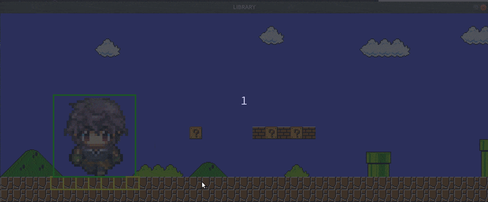

# Sumário
**[SNDE](#snde)** <br/>
**[Usando a lib](#usando-a-lib)**<br/>
**[O que é](#o-que-é)**<br/>

**[01 - Janela](#01-janela)**
* *[Criar janela](#criar-janela)*

**[02 - Imagem](#02-imagem)**
* *[Carregando imagens](#carregando-imagens)*

**[03 - Desenhando imagens](#03-desenhando-imagens)**
* *[draw_image](#draw_image)*
* *[update_screen](#update_screen)*

**[04 - Cenário](#04-cenário)**
* *[Criando mapa](#criando-mapa)*
* *[Mapa montado](#mapa-montado)*
* *[Carregar mapa](#carregar-mapa)*
* *[Desenhar mapa](#desenhar-mapa)*
* *[Colisão](#colisão)*
* *[Camera](#camera)*

**[05 - Eventos](#05-eventos)**
* *[Adicionando eventos](#adicionando-eventos)*
* *[Teclado](#teclado)*
* *[Janela](#janela)*
* *[Outros Eventos](#outros-eventos)*

**[06 - Personagem](#06-personagem)**
* *[Criar personagem](#criar-personagem)*
* *[Animação](#animação)*
* *[Movimentação](#movimentação)*

#

# SNDE
***Sem Necessiade De Existir.***

**Objetivo:**
Apenas criar código descartável. E usar um pouco da ***linguagem C*** / ***Markdown***.

## O que é?
A biblioteca contém funções que abstrai funcionalidades da biblioteca ***Allegro***, facilitando o uso na criação de protótipos de jogos 2D.

***Observação***
Os tipos de dados ***```Window```*** , ***```Image```*** , ***```Events```*** e outros presentes nesse documento, são apenas ***alias*** para a biblioteca ***Allegro*** ou são ***alias*** de componentes da propria biblioteca **snde**.
[Lista com refências dos tipos de dados]("#").

## Usando a lib


**Dependências**
* Allegro 5 :  <a href="https://liballeg.org/download.html" target="_blank"> Instalação</a>


**Importar**
```cpp
#include "lib/snde.h"
```
***Observações***
* Nome temporário ou definitivo;
* Organização de pastas indefinida;

Para começar a utilizar a lib é necessário chamar a função ***```init_all_lib```*** , que realizará algumas configurações. A função retorna ***```true```*** caso todas as configurações foram feitas com sucesso e ***```false```*** se houve alguma falha.

***Assinatura:***
```cpp
bool init_all_lib(void);
```

***Exemplo 0.0***:
```cpp
#include "lib/snde.h"


int main(int argc, char** argv){
    
    if(!init_all_lib())
        return -1;    
    /*

        Código;

    */
    return 0;

}
    
```
Outra função importante é a de limpeza da memória após finalizar o programa,```destroy```, que recebe como parâmetro o elemento a ser limpo e o tipo de dado em **string**.
***Assinatura:***
```cpp
void destroy(void* element, const char* type);
```

## 01 - Janela
### Criar janela

Para criar uma janela, basta declarar uma varialvel do tipo ***```Window```*** , que receba a função ***```create_window```*** .

***Assinatura:***
```c
Window create_window(int width, int height, const char* title);
```
***Exemplo 1.0***:
```cpp
#include "lib/snde.h"


int main(int argc, char** argv){
    
    if(!init_all_lib())
        return -1;

    const char* TITLE = "Titulo da janela";
    const int WIDTH  = 640;
    const int HEIGHT = 480;


    Window screen = create_window(WIDTH, HEIGHT, TITLE);
    
    /*

        Código;

    */

    destroy(screen, "Window");
    
    
    return 0;

}
    
```
##
## 02 - Imagem
### Carregando imagens

Para carregar uma imagem, crie uma variavel do tipo ***```Image```*** , que receberá a função ***```load_image```*** , passando como parâmetro ***```const char* source```*** com o caminho da imagem a partir da raiz do projeto e com a extensão da imagem. 

**OBS**: Apenas os formatos  de imagens ***```.bmp```*** e ***```.png```*** são aceitos.

***Assinatura:***
```cpp
Image load_image(const char* src);

```

***Exemplo 2.0***:
```sh
Árvore de diretórios.

src
├── bmp
│   └── hero.bmp
└── png
    └── hero.png
```

```cpp
#include "lib/snde.h"


int main(int argc, char** argv){

    if(!init_all_lib())
        return -1;

    Image hero_b = load_image("src/bmp/hero.bmp");
    Image hero_p = load_image("src/png/hero.png");
    
    /*

        Código;

    */

    destroy(hero_p, "Image");
    destroy(hero_b, "Image");


    return 0;

}
```
##
## 03 - Desenhando imagens
### draw_image
Para desenhar uma imagem na tela, a janela deve está instanciada e a imagem a ser desenha pronta pra uso. Com os requisitos concluídos basta chamar a função ***```draw_image```*** , passando a imagem a ser desenhada com as coordenas ***```x```*** , ***```y```*** e as configurações de exibição da imagem: 
***escala*** a ser desenha e a ***flag*** de rotação da imagens;

***Assinatura:***
```cpp
void draw_image(Image img, float x,float y, double scale, int flags );
```
##
### update_screen
A função ***```update_screen```*** recebe como parâmetro da taxa de atualização da tela. 


***Assinatura:***
```cpp
void update_screen(double frameperseconds);
```
##
***Exemplo 3.0***:

```cpp
#include "lib/snde.h"
#include <stdbool.h>


int main(int argc, char** argv){

     if(!init_all_lib())
        return -1;

    Window screen = create_window(640, 480, "Desenhando Imagem");
    Image hero_b = load_image("src/imagens_b/hero.bmp");
    
    
    int x = 0;
    int y = 0;
    double scale = 1;
    double fps = 60;


    while(true){

        draw_image(hero_b, x, y, scale, 0);
        update_screen(fps);
    
    }


    destroy(hero_b, "Image");
    destroy(screen, "Window");


    return 0;

}
```

##
## 04 - Cenário
### Criando mapa
Para criação de um arquivo de mapa, o arquivo deve ser criado com o esquema abaixo.

***Exemplo 4.0***:
```cpp
(stateless)
{
    id: "-" label: "ground" src: "src/bmp/map/ground.bmp"
    id: "~" label: "water"  src: "src/bmp/map/water.bmp"
}
(collision)
{
    id: "#" label: "wall"   src: "src/bmp/map/wall.bmp"
}
(map)
{
    ###############################
    #------------#----------------#
    #--#---------#------####------#
    ########-----#------#~~#------#
    #------#-----#------####------#
    #------#-----#----------------#
    #------#-----########--########
    #------#---------------#------#
    #------#-----#####--####------#
    #------------#----------------#
    #------#-----#----------------#
    ###############################
}
```
##
***Exemplo 4.1***:
* Tiles
<figure>
    
    
    
</figure>


```sh
Árvore de diretórios.

├── src
│   ├── bmp
│   │   └── map
│   │       ├── ground.bmp
│   │       ├── wall.bmp
│   │       └── water.bmp
│   └── map
│       └── scenario_00.map
└── main.c
```
```cpp
(stateless)
{
    id: "-" label: "ground" src: "src/bmp/map/ground.bmp"
    id: "~" label: "water"  src: "src/bmp/map/water.bmp"
}
(collision)
{
    id: "#" label: "wall"   src: "src/bmp/map/wall.bmp"
}
(map)
{
    ###############################
    #------------#----------------#
    #--#---------#------####------#
    ########-----#------#~~#------#
    #------#-----#------####------#
    #------#-----#----------------#
    #------#-----########--########
    #------#---------------#------#
    #------#-----#####--####------#
    #------------#----------------#
    #------#-----#----------------#
    ###############################
}
```
***OBS:***
##### Mapa em partes
```cpp
(stateless)
{
    id: "-" label: "ground" src: "src/bmp/map/ground.bmp"
    |
    *-->    id: "identificação do tile no mapa - caracter unico"
    |
    *--> label: "Identifição legivel do tile e que pode ser utilizado do codigo caso seja necessário"
    |
    *-->   src: "Caminho completo do Tile, começando da raiz do projeto"
}

(collsion)
{
}

(especial)
{
}

(map)
{
}
```
* **Tiles**
    * ***stateless***:
        Tiles que não possuem colisão e que serão ignorados na verificação de colisão. 
    * ***collision***:
        Tiles que possuem collisão e que são marcados para vefificar a colisão 
    * ***especial***:
        A seção **especial** como os outros anteriores é opcinal  existir e tem a mesma caracteristicas do **collision**.

    Para que as configurações seja interpredadas corretamente é necessário a existência de no minimo uma dessas seções.
    <br/> 
* **Mapa**
    A seção do mapa é obrigatório existir e tem que ser prenchida com no minimo com o character vazio '.' (ponto).
    
    O mapa tem ter tamanhos concisos. Exemplo, caso a primeira linha contenha 'N' de tamanho todas as linhas deve seguir o 'N' de tamanho e a regra também é aplicada para as colunas, mas podendo ser diferente as linhas, ou seja o mapa pode ter 'N' x 'M' de tamanho.

```cpp
(map)
{
    .............................................
    .............................................
    .............................................
    .............................................
    .............................................
    .............................................
    .............................................
    .............................................
    .............................................
    .............................................
    .............................................
    .............................................
}

```

### Mapa montado


##

### Carregar mapa
Para carregar um aquivo com o mapa, é necessário usar a função ***```load_map```*** passando o caminho do arquivo de mapa|cenario e ***```free_map```*** para limpar a memória alocada com os dados do mapa. 

***Assinatura:***
```cpp
Map load_map(const char *filename, double scale);
```

***Exemplo 4.2***:
```cpp
#include "lib/snde.h"


int main(int argc, char** argv){

    if(!init_all_lib())
        return -1;
    
    double scale = 2.0;
    Map scenarios = load_map("src/map/scenario_00.map", scale);
    
    /*
    
        Código
    
    */

    free_map(scenarios);

    return 0;
}
```

##

### Desenhar mapa
Com o arquivo de mapa já carregado, utilize as funções de câmera.

***Assinatura:***
```cpp
void static_camera(Window *screen, Map *map);
```
***Exemplo 4.3***:
```cpp
#include "lib/snde.h"


int main(int argc, char** argv){

    if(!init_all_lib())
        return -1;

    Window screen = create_window(640, 480, "Desenhar mapa");
    double scale = 2;
    Map scenario = load_map("src/map/scenario_00.map", scale);
    
    double frams = 60;

    while(true)
    {
        static_camera(&screen, scenario);
        update_screen(frams);
    }


    destroy(screen, "Window");
    destroy(scenario, "Map");


    return 0;
}
```

### Colisão
Para adicionar colisão com o mapa, a biblioteca dispoe da função ***```collision_map```*** que retorna ***```false```*** se não houver colisão e ***```true```*** se houver colisão com os objetos que possuem colisão no cenário.

A função ***```collision_map```*** recebe como parâmetros:
* ```void (*callback(Tile *tile, Actor *character))```: Uma função de tratamento da  pós colisão, caso não deseje implementar passe ```NULL``` como parâmetro.   
* ```Map *map``` : Um ponteiro ou a referência para o mapa que deseja verificar a colisão.
* ```Actor *character``` : Um ponteiro ou referência para o um objeto jogavel ou não. Ex: Nave, Inimigo, Heroi etc.


***Assinatura:***
```cpp
bool collision_map(void (*callback(Tile *tile, Actor *character)), Map *map, Actor *character);
```

***Exemplo 4.4***:
**OBS:** Veja a seção de eventos para implementar a movimentação do seu personagem ```Actor```.
<figure>
    
    <figcaption>
    O exemplo acima mostra o sistema de colisão do mapa sendo utilizado. No gif quando o quadrado azul colide com as paredes ele volta pra posição inicial. <strong>OBS: Mapa desenhado em escala 1.5</strong>;
    </figcaption>
</figure>

### Câmera
Realizar o movimento ou rolagem da câmera/cenário com base em um ```Actor``` a biblioteca possui a função ```dynamic_camera``` que recebe com parâmetro a janela alvo```Window```, o mapa ```Map``` que vai possuir a rolagem e como objeto de orientação um ```Actor```.
***Assinatura:***
```cpp
void dynamic_camera(Window *screen, Map *map, Actor *character);
```
Ou caso deseje uma camera estática utilize a função:
```cpp
void static_camera(Window *screen, Map *map);
```
***Exemplo 4.5***:
```cpp
#include "lib/snde.h"


int main(int argc, char** argv){

    if(!init_all_lib())
        return -1;

    double scale = 2.0;
    double frams = 60;

    Window screen = create_window(640, 480, "Desenhar mapa");
    Map scenario = load_map("src/map/scenario_00.map", scale);
    Actor character;

    

    while(true)
    {
        dynamic_camera(&screen, &scenario, &character);
        update_screen(frams);
    }


    destroy(screen, "Window");
    destroy(scenario, "Map");


    return 0;
}
```
***Exemplo 4.6***:

**OBS:** Veja a seção de eventos para implementar a movimentação do seu personagem ```Actor```.
<figure>
    
    <figcaption>
    O exemplo acima mostra o sistema de colisão do mapa sendo utilizado em conjunto com o movimento da câmera. No gif quando o quadrado azul colide com as paredes ele volta pra posição inicial. <strong>OBS: Mapa desenhado em escala 3</strong>;
    </figcaption>
</figure>
##

## 05 - Eventos

Nos exemplos anterios não foi implementado nenhum evento, até o mais simples deles o de fechar a janela do programa.

* ***```Events```*** é utilizado pra instância uma variavel que receberar a fila de eventos.
Existe dois tipos de dados para iniciar o trabalho de eventos no seu software, ***```Events```*** e ***```Event```*** , e duas funções para iniciar os eventos e obter o evento que foi ativado ***```add_event_listener```*** e ***```get_event```*** .
* ***```Event```*** é utilizada pra obter uma estrutura ***```struct```*** com os ***estados*** dos eventos.
* ***```add_event_listener```*** função inicializa todos os eventos e recebe como parâmetro a janela que deseja observar e retorna um ponteiro com do tipo ***```Events```*** .
    ***Assinatura:***
    ```cpp
    Events add_event_listener(Window *screen);
    
    ```
* ***```get_event```*** função obtem uma ***```struct```*** o evento que o estado dos eventos da fila de eventos, que recebe como parâmetro

    ***Assinatura:***
    ```cpp
    Event get_event(Events events);
    ```

### Adicionando eventos
***Exemplo 5.0***:
```cpp
#include "lib/snde.h"


int main(int argc, char** argv){

    if(!init_all_lib())
        return -1;

    Window screen = create_window(640, 480, "Adicionando Eventos");
    Events event_queue = add_event_listener(&screen);


    while(true){
        Event event = get_events(event_queue);

        if(event.type == CLOSE_WINDOW);
            break;
    }


    destroy(screen, "Window");
    destroy(event_queue, "Events");


    return 0;
}

```

### Teclado
    documentation in progress
### Janela
    documentation in progress
### Outros Eventos
    documentation in progress


## 06 - Personagem

Na biblioteca há um estrutura com dados para criação de um personagem 2D, ***```Actor```*** , que é constituida a partir de outras estruturas: ***```Coord```*** , ***```Dimension```*** , ***```Attributes```*** , ***```Sprites```*** .
[link de referência dos tipos dados.](#) 

***Assinatura:***
```cpp
typedef struct  Character
{
    Coord coord;
    Dimension dimen;
    Attributes attr;
    Sprites **mapping;
    Image spritesheet;
    Animation animation;
    Events event_queue;
    double scale;

} Actor;
```

    documentation in progress

### Criar personagem
    documentation in progress
Configurando o Actor com sprites e animações.

### Animação
Para realizar a animação dos sprites, a biblioteca possui a função ***```animation```*** , que recebe como parametros a referencia/ponteiro para um ***```Actor```***  os frames por secundo que cada frame terá de duração e a como terceiro e ultimoparametro a seleção de qual animação será exibida. 

Para realizar a animação dos sprites de um ***```Actor```*** , a biblioteca possui a função ***```run_animation```*** que recebe os parâmetros ***```Actor```*** a ser animado, os frames por segundo que a reproduzirá, um número inteiro referente a animação a ser executada e o controle da animação  **```AnimationControl```**.

***Assinatura:***

```cpp
void run_animation(Actor *character, double framesperseconds, int select_animation, AnimationControl control);
```
##### Spritsheet
<figure>
    
    <figcaption>
    Linha x Coluna
        <br/>
        * Cada linha representa a animação
        <br/>
        * Cada coluna são os frames a ser exibidos
    </figcaption>
</figure>

***Exemplo 6.0***:
```cpp
#include "lib/snde.h"

int main(int argc, char** argv){

    if(!init_all_lib())
        return -1;

    Window screen = create_window(640, 480, "Animação");
    Events event_queue = add_event_listener(&screen);
    Actor character;
        character = load_spritesheet("src/bmp/animation/character2.png", 32, 32, 0,0, 10);
    enum {
        animation_of_walking_to_the_right = 1,
        animation_of_walking_to_the_left  = 2  
    };

    const double framesperseconds = 15.0;

    while(true){

        Event event = get_events(event_queue);

        if(event.type == CLOSE_WINDOW);
            break;

        run_animation(
            &character, 
            framesperseconds, 
            animation_of_walking_to_the_right,
            auto_play
        );
        
    }


    destroy(&screen, "Window");
    destroy(event_queue, "Events");


    return 0;
}

```
#### Configuração e Controle da Animação
```cpp
void run_animation(Actor *character, double framesperseconds, int select_animation, AnimationControl control);
```
***void run_animation***
* Actor character
    * Ator que receberar a animação.
* double frameperseconds
    * Velocidade de exibição dos sprites.
* int select_animation
    * Linha de animação a ser executado.
* AnimationControl animation
    * Controle da animação
    * Controle padrão é **auto_play**.
    * Controle personalizado **animation_control:**
    ***Assinatura:***
        ```cpp
        AnimationControl animation_control(int number_sprites, ...);
        ```
        A função ***animation_control*** recebe como primeiro paramentro o numero de sprites a ser controlados e em seguida a ordem de cada sprite a ser executado.

        ***Exemplo 6.1***:
        ```cpp
        animation_control(
            3, // Número de sprites a ser controlado 
            2, // executar o sprite 2
            0, // executar o sprite 0
            1  // executar o sprite 1
        );
        ```

***Exemplo 6.2***:
<figure>
    
    <figcaption>
    O exemplo acima mostra o sistema de colisão do mapa sendo utilizado em conjunto com o movimento da câmera e o debugger visual da colisão com objetos da cena. Controle da animação sendo usado. <strong>OBS: Mapa desenhado em escala 2 e personagem em escala 6.5</strong>;
    </figcaption>
</figure>

***OBS:***
    Os sprites da spritesheet está ordenado para facilitar a execução da animação.

### Movimentação
    documentation in progress